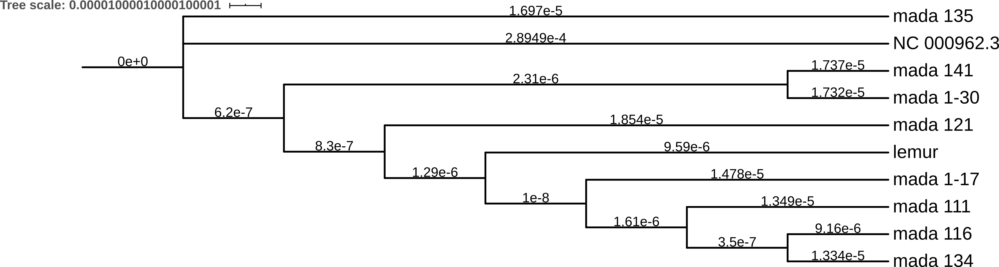

[TOC]: #

# Table of Contents
- [Pipeline overview](#pipeline-overview)
- [Methods](#methods)
  - [Data Preparation](#data-preparation)
  - [Variant and Consensus Calling](#variant-and-consensus-calling)
  - [Lineage Calling](#lineage-calling)
  - [Sample Distances](#sample-distances)
  - [Drug resistance prediction](#drug-resistance-prediction)
- [Results](#results)
  - [Nanopore-based SNP distance is a valid method for ruling out cross-contamination](#nanopore-based-snp-distance-is-a-valid-method-for-ruling-out-cross-contamination)
  - [Lineage 3, Streptomycin-resistance *M. tuberculosis* found in a lemur](#lineage-3-streptomycin-resistance-m-tuberculosis-found-in-a-lemur)
- [References](#references)

## Pipeline overview

## Methods

### Data Preparation

All raw Nanopore data was basecalled using Oxford Nanopore Technologies' (ONT)
proprietary `guppy` software (version 3.4.5).

The quality control step involved decontamination of the reads. We used a manually
curated decontamination database, which contains a wide range of organisms, including
viral, human, *M. tuberculosis* (*Mtb*), non-Tuberculosis *Mycobacterium*, and
nasopharyngeal-associated bacterial genomes. To ensure no DNA from the host was present,
we also included a draft *Lemur catta* genome (accession: PVHV00000000) in this
database. Each genome has associated metadata indicating if it is contamination or not.
Reads are mapped to the database using `minimap2`1 (version 2.17). The
resulting alignment is used to quantify the proportion of reads considered
contamination, unmapped, and wanted. A read is considered wanted if it has any mapping
to a non-contamination genome in the database and is output to a final decontaminated
fastq file (25x depth). All other mapped reads are considered contamination.

### Variant and Consensus Calling

Illumina data was variant called using the Public Health England analysis pipeline,
COMPASS2.

The decontaminated reads were mapped to the *Mtb* reference genome `NC_000962.3` with
`minimap2`. The alignment produced by this was then used to call variant using
`bcftools`3 (version 1.10). Specifically, the output of the `mpileup`
subcommand were passed into the `call` subcommand. For the `mpileup` command, the
minimum base quality for a base to be considered was set to 7 and read-pair overlap
detection was disabled. When running the `call` command, polidy was set to 1, the
multiallelic caller was used, and indels were skipped, meaning the resulting VCF only
contains SNPs. All SNPs with quality (`QUAL` column in VCF) below 60 were excluded, as
were variants with a read position bias less than 0.05, a segregation-based metric above
-0.5, or a variant distance bias below 0.002.

A consensus sequence was generated from the filtered VCF by replacing reference
positions with the called alternate base were relevant. Any positions with a null
genotype or that failed the filtering we masked in the output by replacing the reference
positions with an N. Positions which do not appear in the VCF (i.e. no reads mapped to
this region) were also masked, as were positions in a previously-defined genome mask of
repetitve regions4.

### Lineage Calling

We called the lineage of the sample with two separate methods: variant- and k-mer-based
methods.  
The variant-based method compares genomic positions that are known to be
lineage-defining5,6,7 to the variant calls for the sample. If the sample
contains a lineage-defining SNP that passes all filters, is not in the genome mask, and
has the relevant alternate allele genotype, then the full lineage for that SNP is added
to a list. If a sample contains multiple lineage-defining SNPs from the same major
lineage, then the most recent common ancestor sublineage is used. For example, if the
sample has SNPs for both lineage 3.1.1 and 3.1.2, then it is called lineage 3.1. If is
more than one lineage-defining SNP from a different major lineage, then no lineage call
is made for the sample.  
The k-mer-based method, implemented in the `mykrobe` software8 uses the in
silico equivalent of PCR probes to detect the lineage informative SNPs from Stucki *et
al*9. Using a k-mer size of 21, each SNP allele is defined by 20bp flanking
regions on either side.

### Sample Distances

All consensus sequences were combined into a single fasta file and
`snp-dists`10 (version 0.7.0) was used to calculate a SNP distance matrix.  
A phylogenetic tree was constructed from the consensus sequences, with the addition of
the *Mtb* reference genome `NC_000962.3` to act as an outgroup. FastTree11
was used to construct the tree with the generalised time-reversible model.

### Drug resistance prediction

We ran `mykrobe predict`12 (version 0.8.2) on the decontaminated data using
the Nanopore preset parameter configuration.

## Results

### Nanopore-based SNP distance is a valid method for ruling out cross-contamination

To disprove the hypothesis that this sample was the result of cross-contamination in the
sequencing laboratory, we compared the isolate to other lineage 3 samples sequenced at
the same centre. Eight samples, with both Illumina and Nanopore sequencing from the same
isolate, were used for validation. Firstly, we plot (Figure 1) the pairwise SNP distance
for the eight validation samples. Figure 1 shows that, while the SNP distance between
any one pair is not exactly the same for Nanopore as it is for Illumina (red, dashed
line), it is close enough to be able to use Nanopore SNP distance to rule out
cross-contamination.

  
*Figure 1: Scatter plot showing pairwise SNP distance between the validation samples for
both Illumina and Nanopore SNP calls. Each point is a pair, with the X-axis indicating
that pair's SNP distance based on Illumina variant calls and the Y-axis the distance
based on Nanore variant calls. The red dashed line indicates where the points should
fall if SNP distance were the same on both technologies. The navy line shows the line of
best fit for the observed data with the corresponding linear equation and correlation
coefficient in the legend.*

From the validation distance matrix it is clear that if the *Mtb* isolate taken from the
lemur was cross-contamination it should have a similar SNP distance to one of the
validation samples.  
Figure 2 shows that the lemur sample is sufficiently distant from all other lineage 3
samples that is unlikely to be the result of laboratory cross-contamination. The closest
lemur isolate's closest sample has a distance of 63 SNPs.

  
*Figure 2: Heatmap showing the pairwise SNP distance between the lemur isolate and the
validation samples based on Nanopore SNP calls made with `bcftools`. The colours
indicate the distance with blue being closer and red being more distant.*

As a final validation measure we built a phylogenetic tree of the lemur isolate, the
validation samples, and the *Mtb* reference genome `NC_000962.3` (lineage 4). The tree
in Figure 3 confirm the other lineage calling method that the lemur isolate is from
lineage 3.

  
*Figure 3: Phylogenetic tree built with FastTree of the lemur isolate, validation
samples, and *Mtb* reference `NC_000962.3`.*

### Lineage 3, Streptomycin-resistance *M. tuberculosis* found in a lemur

Using variant calls compared to a panel of lineage-defining SNPs and a k-mer based
classification from `mykrobe` (see [methods](#lineage-calling)) we found the *Mtb*
isolate taken from the lemur to be lineage 3.1.1 (Central Asian sublineage Kilimanjaro
CASI-KILI).

Furthermore, `mykrobe` predicted the lemur isolate to be resistant to Streptomycin. The
causative variant that `mykrobe` identified (R83P/CCG4407954CGG) was additionally found
in the SNP calls and passed all filters.

## References

1. Li, H. Minimap2: pairwise alignment for nucleotide sequences. Bioinformatics 34,
   3094–3100 (2018).
2. Jajou Rana , Kohl Thomas A , Walker Timothy , Norman Anders , Cirillo Daniela Maria ,
   Tagliani Elisa , Niemann Stefan , de Neeling Albert , Lillebaek Troels , Anthony
   Richard M , van Soolingen Dick . Towards standardisation: comparison of five whole
   genome sequencing (WGS) analysis pipelines for detection of epidemiologically linked
   tuberculosis cases. Euro Surveill. 2019;24(50):pii=1900130.
   https://doi.org/10.2807/1560-7917.ES.2019.24.50.1900130
3. Li, H. Improving SNP discovery by base alignment quality. Bioinformatics 27,
   1157–1158 (2011).
4. Walker, T. M. et al. Assessment of Mycobacterium tuberculosis transmission in
   Oxfordshire, UK, 2007–12, with whole pathogen genome sequences: an observational
   study. Lancet Respir Medicine 2, 285–292 (2014).
5. Shitikov, E., Kolchenko, S., Mokrousov, I. et al. Evolutionary pathway analysis and
   unified classification of East Asian lineage of Mycobacterium tuberculosis . Sci Rep
   7, 9227 (2017). https://doi.org/10.1038/s41598-017-10018-5
6. Rutaihwa, L. K. et al. Multiple Introductions of Mycobacterium tuberculosis Lineage
   2–Beijing Into Africa Over Centuries. Frontiers Ecol Evol 7, 112 (2019).
7. Stucki, D. et al. Mycobacterium tuberculosis lineage 4 comprises globally distributed
   and geographically restricted sublineages. Nat Genet 48, 1535–1543 (2016).
8. Bradley, P. et al. Rapid antibiotic-resistance predictions from genome sequence data
   for Staphylococcus aureus and Mycobacterium tuberculosis. Nat Commun 6, 10063 (2015).
9. Stucki, D. et al. Two New Rapid SNP-Typing Methods for Classifying Mycobacterium
   tuberculosis Complex into the Main Phylogenetic Lineages. Plos One 7, e41253 (2012).
10. Seemann, Torsten. Source code for snp-dists software. (2018).
    doi:10.5281/zenodo.1411986
11. Price, M. N., Dehal, P. S. & Arkin, A. P. FastTree 2 – Approximately
    Maximum-Likelihood Trees for Large Alignments. Plos One 5, e9490 (2010).
12. Hunt, M. et al. Antibiotic resistance prediction for Mycobacterium tuberculosis from
    genome sequence data with Mykrobe. Wellcome Open Res 4, 191 (2019).

